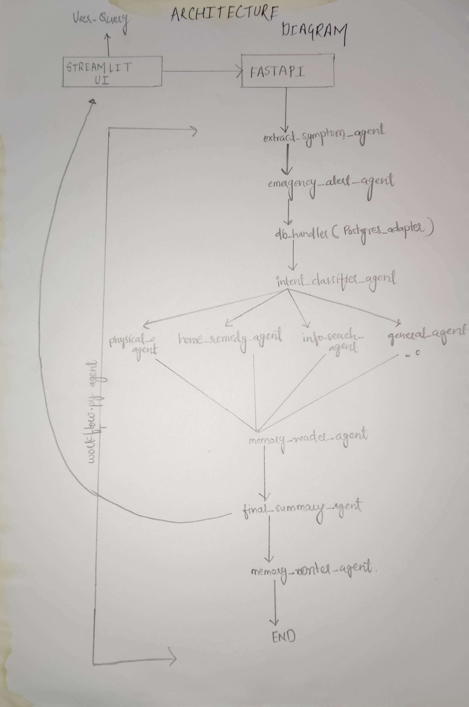

---
# 🌍 HealthBot System Design

A modular, scalable AI healthcare assistant delivering personalized guidance, emergency escalation, and seamless voice/text interactions for all ages.

---

## 🚀 Architecture Overview

- **LangGraph Agents**: Modular, context-driven workflow orchestration.
- **Intent Classifier**: Directs conversation flow based on user intent.
- **FastAPI Backend**: RESTful API for efficient communication.
- **Memory Tracking**: Personalizes responses and supports escalation.
- **Twilio WhatsApp Alerts**: Real-time emergency notifications.
- **Tavily Search**: Enhances info retrieval for the Info Agent.
- **PostgreSQL Database**: Secure, cloud-based data storage.
- **Memory Injector**: Integrates historical context into responses.

---

## 📊 Data Flow

User inputs are processed via LangGraph, routed to specialized agents, stored in PostgreSQL, and escalated via Twilio when needed.

---

## 📦 Core Components

### Backend
- **FastAPI Server**: Powers RESTful API endpoints.
- **LangGraph Workflow**: Coordinates agent interactions.

### Agents
- **Intent Classifier**: Routes queries based on user intent.
- **Symptom Agent**: Identifies and analyzes health symptoms.
- **Home Remedy Agent**: Offers evidence-based remedy suggestions.
- **Emergency Escalation Agent**: Triggers critical alerts.
- **Final Summary Agent**: Provides concise, actionable responses.
- **Memory Reader/Writer**: Manages conversation history.
- **Info Search Agent**: Fetches external health data via Tavily.

### Integrations
- **Database**: SQLite or PostgreSQL for persistent storage.
- **Twilio API**: Sends emergency WhatsApp alerts.
- **.env Config**: Securely stores API keys and credentials.

---

## ⚙️ Scalability & Extensibility

- **Horizontal Scaling**: Stateless FastAPI with load balancer support.
- **Caching**: Redis for faster query responses.
- **Agent Expansion**: Add new agents (e.g., diet, mental health).
- **Database Upgrade**: Use managed cloud DBs (Supabase, Railway).
- **Voice Support**: WebSockets or Twilio IVR for voice access.
- **Monitoring**: Rate limiting and logging via Uvicorn or Sentry.

---

## 🔮 Future Features

- **Smartwatch/IoT**: Real-time vitals (heart rate, SpO2, ECG, BP) with auto-alerts.
- **Multilingual Voice**: Support for Hindi, Tamil, and more.
- **Medical Report OCR**: Extract history from uploaded documents.
- **Medicine Reminders**: WhatsApp-based schedule alerts.
- **Clinic Finder**: Locate nearby facilities via Maps API.
- **Telehealth**: Live doctor chat/call integration.
- **Analytics Dashboard**: Monitor elderly health for caregivers.
- **Lifestyle Coach**: Guide diet, sleep, and fitness.

---

## 🏁 Why HealthBot?

HealthBot empowers **all age groups**, including elders, with intuitive voice/text interfaces, personalized memory, and trusted emergency support.

> **Your health is one sentence away from help.**

*— Team HealthBot*  
*Built with ❤️ for a healthier future.*

---